# Design — synthetic BigQuery data with self-hosted LLMs on Dataflow

> **Status: ACCEPTED** (2026-09-19) — describes the design as built and run on
> Dataflow GPU workers. **Companions:** the [README](../README.md) (what it does,
> measured results), [`DDL_CONTRACT_GUIDE.md`](DDL_CONTRACT_GUIDE.md),
> [`DEPLOYMENT_PREREQUISITES.md`](DEPLOYMENT_PREREQUISITES.md) and
> [`MODEL_LAYOUT.md`](MODEL_LAYOUT.md) (how to operate it).
>
> **How to read a code comment.** The code cites decisions by number
> (`ADR 0036`). Each module that does so names the section of this document to
> read (`Design: docs/DESIGN.md §4 …` in its docstring), and
> [§9](#9-adr-reference-map) maps every number to its section and to the full
> decision record, which carries the alternatives that were rejected and the
> run that motivated the choice.

## 1. Architecture and the CPU/GPU split

**Claim: one Dataflow job reads a bounded sample, touches the GPU a bounded
number of times, and writes validated rows; nothing leaves the project.**

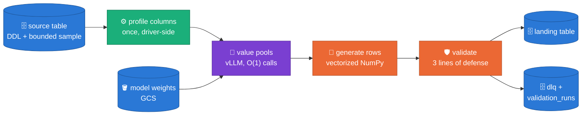

- **The split is by stage, not by machine.** One homogeneous worker pool runs the
  job. Row synthesis, validation and IO are CPU work; the GPU builds free-text
  value pools and, optionally, embeddings. That is what makes the LLM cost
  independent of the row count (§2).
- **No managed AI or data-quality service** is in the serving path ([ADR 0001](https://github.com/albertols/synthetic-llm-dataflow-bigquery/blob/4cba0b6053cf7e9b28434d339ff6e927c981b041/docs/adr/0001-no-managed-gcp-services.md)):
  inference runs inside the pipeline's own `DoFn`s, and validation lands in
  BigQuery tables and GCS artifacts.
- **Reference rows are a live, bounded `SELECT`** with a deterministic order
  ([ADR 0005](https://github.com/albertols/synthetic-llm-dataflow-bigquery/blob/4cba0b6053cf7e9b28434d339ff6e927c981b041/docs/adr/0005-live-select-reference-data.md)), so a run is reproducible from its inputs.
- **One image serves the Flex Template launcher and the workers** ([ADR 0009](https://github.com/albertols/synthetic-llm-dataflow-bigquery/blob/4cba0b6053cf7e9b28434d339ff6e927c981b041/docs/adr/0009-single-flex-template-image.md)). It
  is built in CI, never on a laptop ([ADR 0008](https://github.com/albertols/synthetic-llm-dataflow-bigquery/blob/4cba0b6053cf7e9b28434d339ff6e927c981b041/docs/adr/0008-ci-driven-builds.md)), and pulled from Artifact
  Registry ([ADR 0015](https://github.com/albertols/synthetic-llm-dataflow-bigquery/blob/4cba0b6053cf7e9b28434d339ff6e927c981b041/docs/adr/0015-worker-image-via-artifact-registry.md)). Launcher and workers therefore share one Python version,
  pinned once in `.python-version`.
- All sinks use BigQuery `FILE_LOADS`: the job is batch-shaped.

Code: [`sdfb_beam/pipeline.py::build_pipeline`](../packages/sdfb-beam/src/sdfb_beam/pipeline.py).

## 2. Engines and the LLM as a distribution estimator

**Claim: the LLM is asked what values a column can take, once, and rows are
then sampled without it.** Calling a model per row would make cost grow with
the table; here it grows with the number of free-text columns ([ADR 0013](https://github.com/albertols/synthetic-llm-dataflow-bigquery/blob/4cba0b6053cf7e9b28434d339ff6e927c981b041/docs/adr/0013-distribution-estimator-spine.md)).

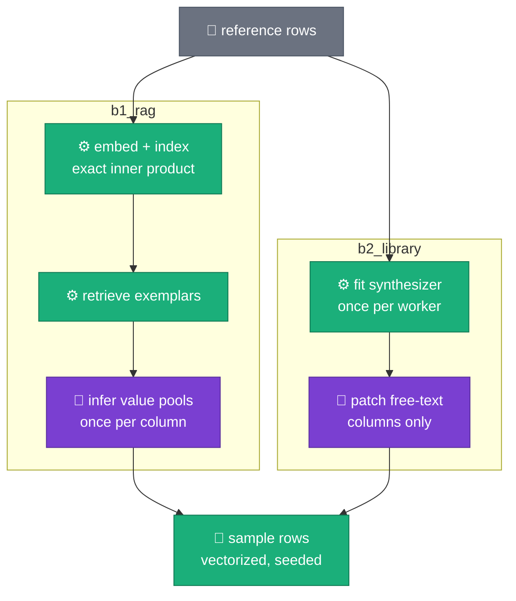

- Both engines implement one `GenerationEngine` ABC and reach the model only
  through the `ModelClient` Protocol ([ADR 0006](https://github.com/albertols/synthetic-llm-dataflow-bigquery/blob/4cba0b6053cf7e9b28434d339ff6e927c981b041/docs/adr/0006-generation-engine-abc.md)), so an engine is testable with
  no Beam, no GPU and no network. A fake client and an Apple-Silicon client
  ([ADR 0010](https://github.com/albertols/synthetic-llm-dataflow-bigquery/blob/4cba0b6053cf7e9b28434d339ff6e927c981b041/docs/adr/0010-m4-local-smoke-mlx.md)) satisfy the same Protocol.
- **`b1_rag`** retrieves representative exemplars from an exact vector index
  to condition the model. The retrieval layer is this repository's own rather
  than `apache_beam.ml.rag` ([ADR 0017](https://github.com/albertols/synthetic-llm-dataflow-bigquery/blob/4cba0b6053cf7e9b28434d339ff6e927c981b041/docs/adr/0017-custom-rag-layer-over-beam-ml-rag.md)): it needs deterministic search and a
  persisted chunk text that is byte-identical to what was embedded. The
  embedding population is scoped to the columns that consume it ([ADR 0019](https://github.com/albertols/synthetic-llm-dataflow-bigquery/blob/4cba0b6053cf7e9b28434d339ff6e927c981b041/docs/adr/0019-rag-population-scoped-to-consumers.md)).
- **`b2_library`** wraps an open-source tabular synthesizer fitted once per
  worker; the model only fills free-text columns.
- Each run logs one `generation_plan` line naming the strategy chosen for every
  column, so the synthesis is auditable from worker logs.

Code: [`sdfb_core/engines/base.py`](../packages/sdfb-core/src/sdfb_core/engines/base.py),
[`engines/b1_rag/`](../packages/sdfb-core/src/sdfb_core/engines/b1_rag),
[`engines/b2_library/`](../packages/sdfb-core/src/sdfb_core/engines/b2_library).

## 3. Serving: a vLLM server owned by the engine

**Claim: each worker runs one vLLM OpenAI-compatible server, started by the
first model call and sized to the GPU it finds** ([ADR 0014](https://github.com/albertols/synthetic-llm-dataflow-bigquery/blob/4cba0b6053cf7e9b28434d339ff6e927c981b041/docs/adr/0014-vllm-model-client-owns-server.md), amending [ADR 0011](https://github.com/albertols/synthetic-llm-dataflow-bigquery/blob/4cba0b6053cf7e9b28434d339ff6e927c981b041/docs/adr/0011-adopt-beam-vllm-model-handler.md)).

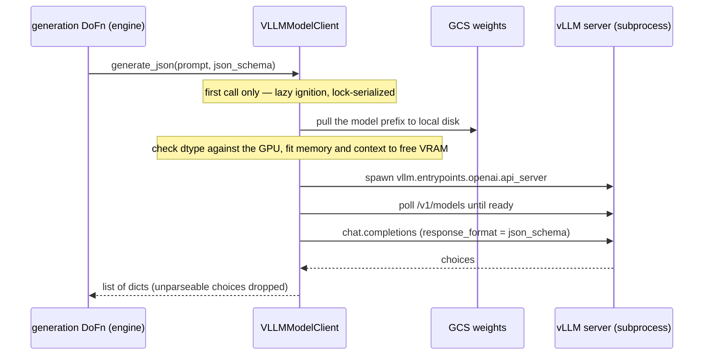

- **Weights come from GCS, never a model hub** at run time; the image sets
  `HF_HUB_OFFLINE=1`. The shortlist of open-weight models is [ADR 0002](https://github.com/albertols/synthetic-llm-dataflow-bigquery/blob/4cba0b6053cf7e9b28434d339ff6e927c981b041/docs/adr/0002-gemma-4-model-shortlist.md); their
  GCS layout is [`MODEL_LAYOUT.md`](MODEL_LAYOUT.md).
- **The schema travels in `response_format`** ([vLLM structured
  outputs](https://docs.vllm.ai/en/latest/usage/structured_outputs.html)), on the
  **chat** endpoint so the model's chat template applies and a thinking channel
  can be switched off per request.
- Byte-identical prompt prefixes make [vLLM automatic prefix
  caching](https://docs.vllm.ai/en/latest/features/automatic_prefix_caching.html)
  effective across the pool-building calls of one table.

### Why not `apache_beam.ml.inference.vllm_inference`

Beam ships [`VLLMCompletionsModelHandler` and
`VLLMChatModelHandler`](https://beam.apache.org/releases/pydoc/current/apache_beam.ml.inference.vllm_inference.html).
They start the same server from the `vllm` package in the worker image; what
differs is who drives it. [ADR 0011](https://github.com/albertols/synthetic-llm-dataflow-bigquery/blob/4cba0b6053cf7e9b28434d339ff6e927c981b041/docs/adr/0011-adopt-beam-vllm-model-handler.md) chose them; [ADR 0014](https://github.com/albertols/synthetic-llm-dataflow-bigquery/blob/4cba0b6053cf7e9b28434d339ff6e927c981b041/docs/adr/0014-vllm-model-client-owns-server.md) reversed that a day
later, before any code used them, once the engines' call pattern was fixed.

**Claim: Beam's handlers run inference over a `PCollection` of prompts; here
the prompts are decided one at a time by a loop that reads the previous
answer, and a Beam graph has no loop.**

**Beam `vllm_inference` — prompts are the data.** Every prompt exists before
inference starts, and one `inference_args` dict serves all of them.

**This pipeline — rows are the data, prompts are a loop.** The answer to one
call decides whether there is a next call and what it asks.

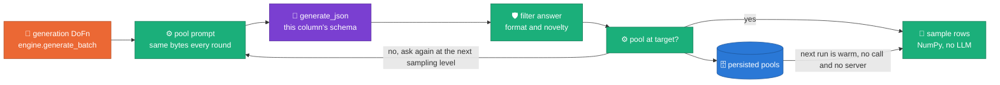

| | Beam `vllm_inference` (2.74.0) | `VLLMModelClient` |
| :-- | :-- | :-- |
| **What flows through the LLM step** | Prompts: inference is a `PTransform` between two `PCollection`s | Nothing. The `PCollection` carries row batches; the model is called from inside `generate_batch()` and returns to the caller |
| **Who decides the next prompt** | The graph: every prompt exists before inference starts | The engine: each round takes the next sampling level (`temperature`, `top_p`, `top_k`), filters the answer by format and by novelty against the source domain (§5), then decides whether to ask again |
| **Request arguments** | One `inference_args` dict per transform, applied to every element | Per call: the JSON schema of that column, and the `temperature` / `top_p` / `top_k` of that round |
| **How many calls** | One per element | A bounded number per free-text column, whatever the row count (§2) |
| **When the server starts** | In `load_model()`, on every worker running the transform | On the first real call: a table with no free-text column, or a run whose pools are already persisted, never loads a model |
| **Model location** | Passed to `--model` as given | A `gs://` prefix pulled to local disk once per worker |
| **dtype against the GPU** | Not checked | Refuses bfloat16 below compute capability 8.0, and a float16 downcast for a family that emits empty output in float16 |
| **GPU memory** | The flags the caller passes | Utilization from **free** VRAM at spawn (the embedder shares the GPU); `max-model-len` clamped to what the KV cache can hold |
| **Where the engine can run** | Needs Beam and a runner to reach the model | The engines import no Beam: the same code runs against a fake client on a laptop and vLLM on Dataflow |

What is **not** a difference: Beam's chat handler reaches the chat endpoint
too, and `response_format` or `extra_body` pass through `inference_args`
unchanged. Structured output is possible with Beam; varying it per call, or
letting an answer choose the next question, is not.

**vLLM's own optimizations are the server's, in both cases.** Continuous
batching, PagedAttention and the prefix cache are implemented by the vLLM
server that both approaches start, so this choice neither gains nor loses
them. What a client controls is what it feeds them:

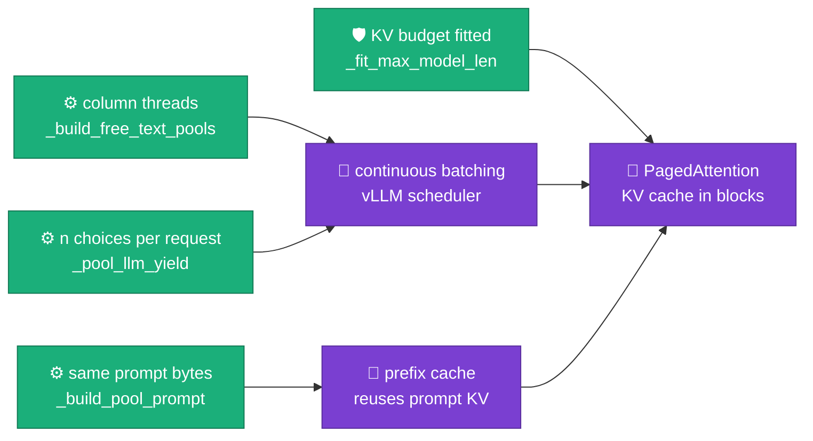

| Technique (server-side) | Beam `vllm_inference` | This pipeline |
| :-- | :-- | :-- |
| **Continuous batching**: the scheduler batches whatever is in flight | One Beam batch in flight: `asyncio.gather` over one request per prompt (`_async_run_inference`) | `n` independent completions per request (`_pool_llm_yield`) and several column ladders at once (`B1RagEngine._build_free_text_pools`), against one server per worker |
| **PagedAttention / KV cache**: KV memory in blocks | Budget is the flags the caller passes | Fitted before spawn from the checkpoint's geometry and **free** VRAM (`_kv_bytes_per_token`, `_fit_max_model_len`, `_clamp_max_model_len`, `_dynamic_gpu_memory_utilization`); the embedder leaves the GPU first |
| **Automatic prefix caching**: a shared prompt prefix reuses its KV blocks | Prompts are not shaped by the handler | A column's pool prompt is byte-identical across rounds and constraints are a constant suffix (`_build_pool_prompt`), so later rounds reuse the cached prompt; the opt-in `kcenter_rotate` strategy gives that up on purpose |

Beam's handler is the right tool whenever prompts *are* the data (classify,
summarize or extract from each element). If this pipeline ever generates a
free-text value per row with the model, that stage should be `RunInference`,
and the `ModelClient` seam lets it be added without touching the engines.
The price of owning the server is about a thousand lines of lifecycle code
and no `RunInference` metrics. Code:
[`sdfb_beam/handlers/vllm_client.py`](../packages/sdfb-beam/src/sdfb_beam/handlers/vllm_client.py),
[`engines/b1_rag/engine.py::_pool_llm_yield`](../packages/sdfb-core/src/sdfb_core/engines/b1_rag/engine.py).

## 4. Relational generation

**Claim: a child table is generated from its parent's landed keys, so the
parent/child ratio, the child's key uniqueness and referential integrity hold
by construction rather than by rejection.**

One Dataflow job generates a whole connected component of the relationship
model, parents first, with one vLLM server and table-tagged logs ([ADR 0030](https://github.com/albertols/synthetic-llm-dataflow-bigquery/blob/4cba0b6053cf7e9b28434d339ff6e927c981b041/docs/adr/0030-single-job-relational-generation.md)).
Which tables join a launch follows from two inputs, the landing table and one
flag ([ADR 0029](https://github.com/albertols/synthetic-llm-dataflow-bigquery/blob/4cba0b6053cf7e9b28434d339ff6e927c981b041/docs/adr/0029-fk-model-scenarios-and-history-mappings.md), §8). The structure is declared once in versioned YAML and never
read from a table description ([ADR 0032](https://github.com/albertols/synthetic-llm-dataflow-bigquery/blob/4cba0b6053cf7e9b28434d339ff6e927c981b041/docs/adr/0032-relationships-as-config.md), which supersedes [ADR 0021](https://github.com/albertols/synthetic-llm-dataflow-bigquery/blob/4cba0b6053cf7e9b28434d339ff6e927c981b041/docs/adr/0021-relational-contract-in-descriptions.md)).

### 4.1 Children from parent keys

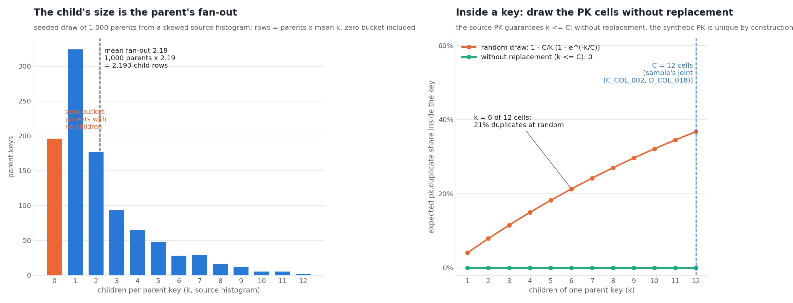

*Left: a child's size is the parent key count times the source's
children-per-parent histogram, zero bucket included, so it is derived and not
requested. Right: inside one parent key, drawing the key-completing cells at
random collides; drawing them without replacement never does.* Formally, a
primary key that contains a foreign key is unique **within** each parent key,
so the draw is structured per parent key ([ADR 0036](https://github.com/albertols/synthetic-llm-dataflow-bigquery/blob/4cba0b6053cf7e9b28434d339ff6e927c981b041/docs/adr/0036-parent-driven-fanout-generation.md)). A preflight counts the
distinct keys a model can produce against the rows asked for, including the
members bound by a foreign key ([ADR 0035](https://github.com/albertols/synthetic-llm-dataflow-bigquery/blob/4cba0b6053cf7e9b28434d339ff6e927c981b041/docs/adr/0035-pk-capacity-fk-bound-members.md)). Code:
[`engines/fanout.py::FanoutPlan`](../packages/sdfb-core/src/sdfb_core/engines/fanout.py).

### 4.2 Several parents: every edge gets a role

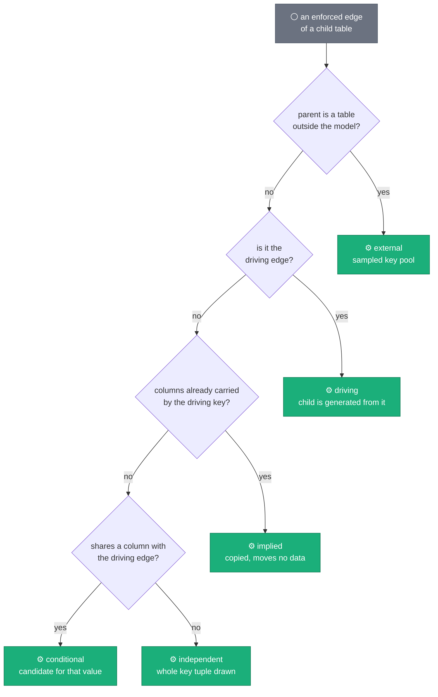

Stars, diamonds, trees, forests, 1:1 chains and a child that reaches both its
parent and its grandparent all generate from one declared model ([ADR 0037](https://github.com/albertols/synthetic-llm-dataflow-bigquery/blob/4cba0b6053cf7e9b28434d339ff6e927c981b041/docs/adr/0037-multi-parent-children.md)).
The roles are derived from the declared columns and the model's own graph;
nothing new is declared. The driving edge is the one marked `drives: true`,
else the first declared, and the launcher says which. An `external` parent is
a dataset-qualified table that is already landed. Code:
[`contracts/relationships.py::RelationshipRegistry`](../packages/sdfb-core/src/sdfb_core/contracts/relationships.py).

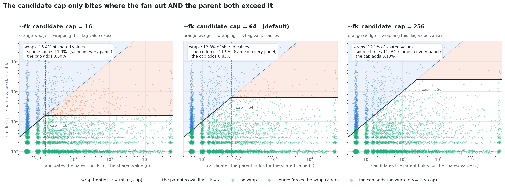

*A shared value's candidate list is truncated only when its distinct candidates
outrun the cap.* Formally the list holds `min(c, M)` entries for `c` candidates
and cap `M`, so the source's tail decides and the cap is a flag. Code:
[`sdfb_beam/pipeline.py::_conditional_candidates`](../packages/sdfb-beam/src/sdfb_beam/pipeline.py).

### 4.3 Key tuples are drawn jointly

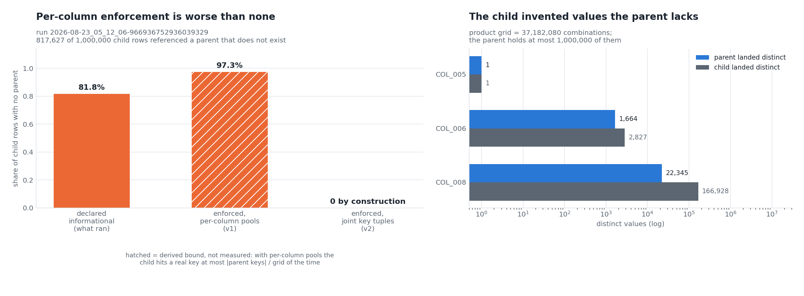

*Drawing each column of a composite key on its own orphans more rows than not
enforcing the key at all; drawing whole observed tuples orphans none.* Where a
child draws from a key pool (an `independent` or `external` edge), it draws
**joint tuples from observed parent combinations**, weighted by iteratively
fitted marginals ([ADR 0031](https://github.com/albertols/synthetic-llm-dataflow-bigquery/blob/4cba0b6053cf7e9b28434d339ff6e927c981b041/docs/adr/0031-joint-fk-key-draws.md)). An orphaned child row is a blocker: the run fails.
Code: [`engines/fk_keys.py::FkKeyPool`](../packages/sdfb-core/src/sdfb_core/engines/fk_keys.py),
[`dofns/fk_integrity.py`](../packages/sdfb-beam/src/sdfb_beam/dofns/fk_integrity.py).

### 4.4 When the source disproves the model

A full-source measurement can show that a declared primary key is not a key of
the source. The launch then drops it from the **effective** model for that run,
prints a `MODEL ADJUSTED` banner with the YAML to paste back, and carries on;
`--on_model_conflict=stop` restores the refusal, and a model that contradicts
itself always stops ([ADR 0038](https://github.com/albertols/synthetic-llm-dataflow-bigquery/blob/4cba0b6053cf7e9b28434d339ff6e927c981b041/docs/adr/0038-measured-conflicts-adjust-the-model.md)). A launch also states how many rows each table
will receive and where each number came from, before the graph is built
([ADR 0039](https://github.com/albertols/synthetic-llm-dataflow-bigquery/blob/4cba0b6053cf7e9b28434d339ff6e927c981b041/docs/adr/0039-row-projection-before-the-graph.md), proposed). Code:
[`contracts/model_adjustment.py`](../packages/sdfb-core/src/sdfb_core/contracts/model_adjustment.py),
[`contracts/row_projection.py`](../packages/sdfb-core/src/sdfb_core/contracts/row_projection.py).

## 5. Fidelity, value pools and constraints

**Claim: numeric and temporal values are drawn where the source is dense, not
uniformly across its range.**

*Uniform-in-range sampling flattens a skewed column; sampling through its
deciles preserves the shape.* Formally this is inverse transform sampling over
a piecewise-linear CDF built from an 11-point decile vector, part of a
per-column profile measured once and persisted ([ADR 0022](https://github.com/albertols/synthetic-llm-dataflow-bigquery/blob/4cba0b6053cf7e9b28434d339ff6e927c981b041/docs/adr/0022-stats-driven-generation.md)). Code:
[`engines/b1_rag/_fidelity.py::ColumnSampler`](../packages/sdfb-core/src/sdfb_core/engines/b1_rag/_fidelity.py),
[`stats/source_stats.py`](../packages/sdfb-core/src/sdfb_core/stats/source_stats.py).

- **Categoricals** use the empirical frequency table and never invent an unseen
  category; identifiers are shaped deterministically and never reach the model;
  marginal fidelity holds by construction rather than by a post-hoc fix
  ([ADR 0025](https://github.com/albertols/synthetic-llm-dataflow-bigquery/blob/4cba0b6053cf7e9b28434d339ff6e927c981b041/docs/adr/0025-marginal-fidelity-by-construction.md), refined by [ADR 0026](https://github.com/albertols/synthetic-llm-dataflow-bigquery/blob/4cba0b6053cf7e9b28434d339ff6e927c981b041/docs/adr/0026-measurement-first-mask-integrity.md) and verified in [ADR 0027](https://github.com/albertols/synthetic-llm-dataflow-bigquery/blob/4cba0b6053cf7e9b28434d339ff6e927c981b041/docs/adr/0027-verified-wave4-operational-integrity.md)).
- **Free-text pools** are the only model output. They are built in parallel
  batches ([ADR 0018](https://github.com/albertols/synthetic-llm-dataflow-bigquery/blob/4cba0b6053cf7e9b28434d339ff6e927c981b041/docs/adr/0018-parallel-batched-freetext-pools.md)), persisted and reused across runs keyed by the reference
  digest and model ([ADR 0020](https://github.com/albertols/synthetic-llm-dataflow-bigquery/blob/4cba0b6053cf7e9b28434d339ff6e927c981b041/docs/adr/0020-freetext-pools-as-persisted-artifact.md)), and every candidate is rejected against the
  **full** source domain, not only the sample, so a pool cannot memorize
  ([ADR 0023](https://github.com/albertols/synthetic-llm-dataflow-bigquery/blob/4cba0b6053cf7e9b28434d339ff6e927c981b041/docs/adr/0023-source-domain-pool-rejection.md)). A retry ladder keeps pools honest at scale ([ADR 0033](https://github.com/albertols/synthetic-llm-dataflow-bigquery/blob/4cba0b6053cf7e9b28434d339ff6e927c981b041/docs/adr/0033-pool-ladder-integrity-at-scale.md)).
- **Per-column prompt constraints** (clauses, length bands, format masks) ride
  the DDL contract as structured templates ([ADR 0024](https://github.com/albertols/synthetic-llm-dataflow-bigquery/blob/4cba0b6053cf7e9b28434d339ff6e927c981b041/docs/adr/0024-structured-prompt-constraint-templates.md)). A constraint router
  decides per column whether a constraint is satisfied by construction or must
  reach the model ([ADR 0028](https://github.com/albertols/synthetic-llm-dataflow-bigquery/blob/4cba0b6053cf7e9b28434d339ff6e927c981b041/docs/adr/0028-constraint-router-relational-plan.md)). Worked examples:
  [`DDL_CONTRACT_GUIDE.md`](DDL_CONTRACT_GUIDE.md).

## 6. Throughput

**Claim: with the model called a bounded number of times, the job's time is CPU
generation and shuffle, not the GPU.**

*Warming the pools removes only the pool branch; CPU generation and the
uniqueness shuffle dominate both the cold and the warm job.* That measurement
set the throughput decisions ([ADR 0034](https://github.com/albertols/synthetic-llm-dataflow-bigquery/blob/4cba0b6053cf7e9b28434d339ff6e927c981b041/docs/adr/0034-generation-throughput-single-barrier-shared-engines.md)): exact uniqueness runs **one** full-row
barrier; a worker process builds one engine per table and every `DoFn`
instance shares it; and a fleet sized by hand stays that size, because
autoscaling is pinned off when the launch names its worker count. Multiple SDK
containers per worker are launchable but opt-in, because sibling processes
then race for one GPU (§3 handles that case). Code:
[`dofns/uniqueness.py`](../packages/sdfb-beam/src/sdfb_beam/dofns/uniqueness.py),
[`dofns/generate.py::GenerateRecordsDoFn`](../packages/sdfb-beam/src/sdfb_beam/dofns/generate.py).

## 7. Validation and the dead-letter queue

**Claim: no row is dropped silently; every rejection is queryable with its
reason, and the audit row lands even when the run fails.**

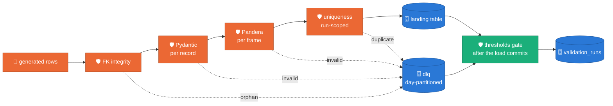

The record model, the dataframe schema and the BigQuery schema are all derived
from the table's DDL, so they cannot disagree. Findings carry a severity; the
observed blocker ratio is checked against a per-environment budget in
[`config/thresholds.yml`](../config/thresholds.yml). A memorization gate fails a run
on any identical real/synthetic row. Code:
[`dofns/validate_record.py`](../packages/sdfb-beam/src/sdfb_beam/dofns/validate_record.py),
[`dofns/pandera_batch.py`](../packages/sdfb-beam/src/sdfb_beam/dofns/pandera_batch.py),
[`validation/summary.py`](../packages/sdfb-core/src/sdfb_core/validation/summary.py).

## 8. Configuration

Relational structure is configuration, in
[`config/relationships/*.yaml`](../config/relationships/README.md) ([ADR 0032](https://github.com/albertols/synthetic-llm-dataflow-bigquery/blob/4cba0b6053cf7e9b28434d339ff6e927c981b041/docs/adr/0032-relationships-as-config.md)).

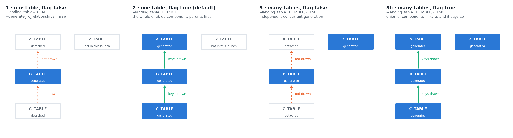

*One model, four launches: the landing table and one flag decide which tables
a launch generates and which edges draw keys.* Code:
[`contracts/relationships.py::RelationshipRegistry`](../packages/sdfb-core/src/sdfb_core/contracts/relationships.py).

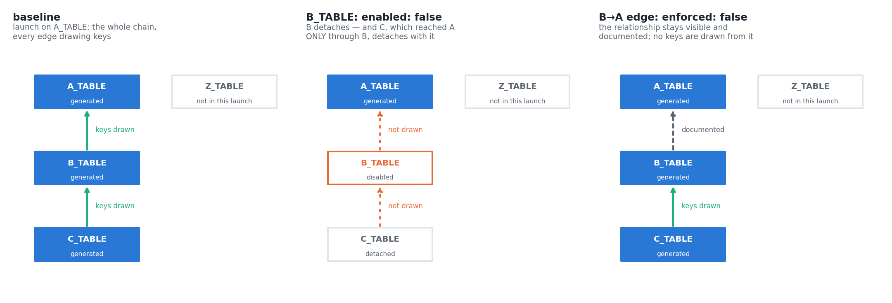

*One panel per mode. `enabled: false` on a table removes it from the graph,
with anything that reached the model only through it. `enforced: false` on an
edge keeps the table and stops drawing keys through that edge.*

| Knob | Where | Read by |
| :-- | :-- | :-- |
| Tables, keys, edges, `enabled` / `enforced` / `drives` | `config/relationships/*.yaml` | launcher and workers; one relationship card is logged per run |
| Model URI, vLLM server flags, licence | [`config/models.yml`](../config/models.yml) | `VLLMModelClient` (§3) |
| Severity budgets per environment | [`config/thresholds.yml`](../config/thresholds.yml) | thresholds gate (§7) |
| Column constraints | the table's DDL contract | constraint router (§5) |
| GPU type, machine family, dtype | the Terraform module's `gpu` variable | launch scripts and the Flex Template job |

## 9. ADR reference map

Decision records live in the source repository. A link below opens the full
record; the section is where this document summarizes it.

<!-- adr-map:start -->
| ADR | Section | Decision record |
| :-- | :-- | :-- |
| 0001 | [§1 Architecture](#1-architecture-and-the-cpugpu-split) | [No managed GCP services in the serving path](https://github.com/albertols/synthetic-llm-dataflow-bigquery/blob/4cba0b6053cf7e9b28434d339ff6e927c981b041/docs/adr/0001-no-managed-gcp-services.md) |
| 0002 | [§3 Serving](#3-serving-a-vllm-server-owned-by-the-engine) | [Open-weight model shortlist](https://github.com/albertols/synthetic-llm-dataflow-bigquery/blob/4cba0b6053cf7e9b28434d339ff6e927c981b041/docs/adr/0002-gemma-4-model-shortlist.md) |
| 0003 | [§1 Architecture](#1-architecture-and-the-cpugpu-split) | [Private container registry (withdrawn)](https://github.com/albertols/synthetic-llm-dataflow-bigquery/blob/4cba0b6053cf7e9b28434d339ff6e927c981b041/docs/adr/0003-jfrog-image-registry.md) |
| 0004 | [§1 Architecture](#1-architecture-and-the-cpugpu-split) | [Dataflow region](https://github.com/albertols/synthetic-llm-dataflow-bigquery/blob/4cba0b6053cf7e9b28434d339ff6e927c981b041/docs/adr/0004-europe-west3-region.md) |
| 0005 | [§1 Architecture](#1-architecture-and-the-cpugpu-split) | [Live SELECT for reference rows](https://github.com/albertols/synthetic-llm-dataflow-bigquery/blob/4cba0b6053cf7e9b28434d339ff6e927c981b041/docs/adr/0005-live-select-reference-data.md) |
| 0006 | [§2 Engines](#2-engines-and-the-llm-as-a-distribution-estimator) | [`GenerationEngine` ABC and `ModelClient` Protocol](https://github.com/albertols/synthetic-llm-dataflow-bigquery/blob/4cba0b6053cf7e9b28434d339ff6e927c981b041/docs/adr/0006-generation-engine-abc.md) |
| 0007 | [§9 ADR reference map](#9-adr-reference-map) | [One source of truth across docs and code](https://github.com/albertols/synthetic-llm-dataflow-bigquery/blob/4cba0b6053cf7e9b28434d339ff6e927c981b041/docs/adr/0007-dry-documentation-policy.md) |
| 0008 | [§1 Architecture](#1-architecture-and-the-cpugpu-split) | [Images are built in CI](https://github.com/albertols/synthetic-llm-dataflow-bigquery/blob/4cba0b6053cf7e9b28434d339ff6e927c981b041/docs/adr/0008-ci-driven-builds.md) |
| 0009 | [§1 Architecture](#1-architecture-and-the-cpugpu-split) | [One image for launcher and workers](https://github.com/albertols/synthetic-llm-dataflow-bigquery/blob/4cba0b6053cf7e9b28434d339ff6e927c981b041/docs/adr/0009-single-flex-template-image.md) |
| 0010 | [§2 Engines](#2-engines-and-the-llm-as-a-distribution-estimator) | [Local smoke test on Apple Silicon](https://github.com/albertols/synthetic-llm-dataflow-bigquery/blob/4cba0b6053cf7e9b28434d339ff6e927c981b041/docs/adr/0010-m4-local-smoke-mlx.md) |
| 0011 | [§3 Serving](#3-serving-a-vllm-server-owned-by-the-engine) | [Adopt Beam's vLLM handler (amended by 0014)](https://github.com/albertols/synthetic-llm-dataflow-bigquery/blob/4cba0b6053cf7e9b28434d339ff6e927c981b041/docs/adr/0011-adopt-beam-vllm-model-handler.md) |
| 0012 | [§1 Architecture](#1-architecture-and-the-cpugpu-split) | [Image build under network constraints (withdrawn)](https://github.com/albertols/synthetic-llm-dataflow-bigquery/blob/4cba0b6053cf7e9b28434d339ff6e927c981b041/docs/adr/0012-enterprise-image-build.md) |
| 0013 | [§2 Engines](#2-engines-and-the-llm-as-a-distribution-estimator) | [The LLM as a distribution estimator](https://github.com/albertols/synthetic-llm-dataflow-bigquery/blob/4cba0b6053cf7e9b28434d339ff6e927c981b041/docs/adr/0013-distribution-estimator-spine.md) |
| 0014 | [§3 Serving](#3-serving-a-vllm-server-owned-by-the-engine) | [The model client owns the vLLM server](https://github.com/albertols/synthetic-llm-dataflow-bigquery/blob/4cba0b6053cf7e9b28434d339ff6e927c981b041/docs/adr/0014-vllm-model-client-owns-server.md) |
| 0015 | [§1 Architecture](#1-architecture-and-the-cpugpu-split) | [Worker image in Artifact Registry](https://github.com/albertols/synthetic-llm-dataflow-bigquery/blob/4cba0b6053cf7e9b28434d339ff6e927c981b041/docs/adr/0015-worker-image-via-artifact-registry.md) |
| 0016 | [§1 Architecture](#1-architecture-and-the-cpugpu-split) | [Images on Cloud Build](https://github.com/albertols/synthetic-llm-dataflow-bigquery/blob/4cba0b6053cf7e9b28434d339ff6e927c981b041/docs/adr/0016-personal-gcp-cloud-build.md) |
| 0017 | [§2 Engines](#2-engines-and-the-llm-as-a-distribution-estimator) | [Own retrieval layer instead of `apache_beam.ml.rag`](https://github.com/albertols/synthetic-llm-dataflow-bigquery/blob/4cba0b6053cf7e9b28434d339ff6e927c981b041/docs/adr/0017-custom-rag-layer-over-beam-ml-rag.md) |
| 0018 | [§5 Fidelity](#5-fidelity-value-pools-and-constraints) | [Batched, parallel free-text pool builds](https://github.com/albertols/synthetic-llm-dataflow-bigquery/blob/4cba0b6053cf7e9b28434d339ff6e927c981b041/docs/adr/0018-parallel-batched-freetext-pools.md) |
| 0019 | [§2 Engines](#2-engines-and-the-llm-as-a-distribution-estimator) | [Embedding population scoped to its consumers](https://github.com/albertols/synthetic-llm-dataflow-bigquery/blob/4cba0b6053cf7e9b28434d339ff6e927c981b041/docs/adr/0019-rag-population-scoped-to-consumers.md) |
| 0020 | [§5 Fidelity](#5-fidelity-value-pools-and-constraints) | [Free-text pools as a persisted artifact](https://github.com/albertols/synthetic-llm-dataflow-bigquery/blob/4cba0b6053cf7e9b28434d339ff6e927c981b041/docs/adr/0020-freetext-pools-as-persisted-artifact.md) |
| 0021 | [§4 Relational generation](#4-relational-generation) | [Relational contract in column descriptions (superseded by 0032)](https://github.com/albertols/synthetic-llm-dataflow-bigquery/blob/4cba0b6053cf7e9b28434d339ff6e927c981b041/docs/adr/0021-relational-contract-in-descriptions.md) |
| 0022 | [§5 Fidelity](#5-fidelity-value-pools-and-constraints) | [Source table statistics as a generation input](https://github.com/albertols/synthetic-llm-dataflow-bigquery/blob/4cba0b6053cf7e9b28434d339ff6e927c981b041/docs/adr/0022-stats-driven-generation.md) |
| 0023 | [§5 Fidelity](#5-fidelity-value-pools-and-constraints) | [Pools reject against the full source domain](https://github.com/albertols/synthetic-llm-dataflow-bigquery/blob/4cba0b6053cf7e9b28434d339ff6e927c981b041/docs/adr/0023-source-domain-pool-rejection.md) |
| 0024 | [§5 Fidelity](#5-fidelity-value-pools-and-constraints) | [Structured prompt-constraint templates](https://github.com/albertols/synthetic-llm-dataflow-bigquery/blob/4cba0b6053cf7e9b28434d339ff6e927c981b041/docs/adr/0024-structured-prompt-constraint-templates.md) |
| 0025 | [§5 Fidelity](#5-fidelity-value-pools-and-constraints) | [Marginal fidelity by construction](https://github.com/albertols/synthetic-llm-dataflow-bigquery/blob/4cba0b6053cf7e9b28434d339ff6e927c981b041/docs/adr/0025-marginal-fidelity-by-construction.md) |
| 0026 | [§5 Fidelity](#5-fidelity-value-pools-and-constraints) | [Measurement first, then mask integrity](https://github.com/albertols/synthetic-llm-dataflow-bigquery/blob/4cba0b6053cf7e9b28434d339ff6e927c981b041/docs/adr/0026-measurement-first-mask-integrity.md) |
| 0027 | [§5 Fidelity](#5-fidelity-value-pools-and-constraints) | [Verification cycle and operational integrity](https://github.com/albertols/synthetic-llm-dataflow-bigquery/blob/4cba0b6053cf7e9b28434d339ff6e927c981b041/docs/adr/0027-verified-wave4-operational-integrity.md) |
| 0028 | [§5 Fidelity](#5-fidelity-value-pools-and-constraints) | [Constraint router and relational plan](https://github.com/albertols/synthetic-llm-dataflow-bigquery/blob/4cba0b6053cf7e9b28434d339ff6e927c981b041/docs/adr/0028-constraint-router-relational-plan.md) |
| 0029 | [§4 Relational generation](#4-relational-generation) | [Launch scenarios for a relationship model](https://github.com/albertols/synthetic-llm-dataflow-bigquery/blob/4cba0b6053cf7e9b28434d339ff6e927c981b041/docs/adr/0029-fk-model-scenarios-and-history-mappings.md) |
| 0030 | [§4 Relational generation](#4-relational-generation) | [Single-job relational generation](https://github.com/albertols/synthetic-llm-dataflow-bigquery/blob/4cba0b6053cf7e9b28434d339ff6e927c981b041/docs/adr/0030-single-job-relational-generation.md) |
| 0031 | [§4 Relational generation](#4-relational-generation) | [Joint foreign-key draws](https://github.com/albertols/synthetic-llm-dataflow-bigquery/blob/4cba0b6053cf7e9b28434d339ff6e927c981b041/docs/adr/0031-joint-fk-key-draws.md) |
| 0032 | [§8 Configuration](#8-configuration) | [Relationships are configuration](https://github.com/albertols/synthetic-llm-dataflow-bigquery/blob/4cba0b6053cf7e9b28434d339ff6e927c981b041/docs/adr/0032-relationships-as-config.md) |
| 0033 | [§5 Fidelity](#5-fidelity-value-pools-and-constraints) | [Pool-ladder integrity at scale](https://github.com/albertols/synthetic-llm-dataflow-bigquery/blob/4cba0b6053cf7e9b28434d339ff6e927c981b041/docs/adr/0033-pool-ladder-integrity-at-scale.md) |
| 0034 | [§6 Throughput](#6-throughput) | [One barrier, shared engines](https://github.com/albertols/synthetic-llm-dataflow-bigquery/blob/4cba0b6053cf7e9b28434d339ff6e927c981b041/docs/adr/0034-generation-throughput-single-barrier-shared-engines.md) |
| 0035 | [§4 Relational generation](#4-relational-generation) | [Key capacity counts foreign-key-bound members](https://github.com/albertols/synthetic-llm-dataflow-bigquery/blob/4cba0b6053cf7e9b28434d339ff6e927c981b041/docs/adr/0035-pk-capacity-fk-bound-members.md) |
| 0036 | [§4 Relational generation](#4-relational-generation) | [Parent-driven fan-out generation](https://github.com/albertols/synthetic-llm-dataflow-bigquery/blob/4cba0b6053cf7e9b28434d339ff6e927c981b041/docs/adr/0036-parent-driven-fanout-generation.md) |
| 0037 | [§4 Relational generation](#4-relational-generation) | [Multi-parent children](https://github.com/albertols/synthetic-llm-dataflow-bigquery/blob/4cba0b6053cf7e9b28434d339ff6e927c981b041/docs/adr/0037-multi-parent-children.md) |
| 0038 | [§4 Relational generation](#4-relational-generation) | [Measured conflicts adjust the model](https://github.com/albertols/synthetic-llm-dataflow-bigquery/blob/4cba0b6053cf7e9b28434d339ff6e927c981b041/docs/adr/0038-measured-conflicts-adjust-the-model.md) |
| 0039 | [§4 Relational generation](#4-relational-generation) | [Row projection before the graph (proposed)](https://github.com/albertols/synthetic-llm-dataflow-bigquery/blob/4cba0b6053cf7e9b28434d339ff6e927c981b041/docs/adr/0039-row-projection-before-the-graph.md) |
| 0040 | [§9 ADR reference map](#9-adr-reference-map) | [Publishing this design to the Dataflow Solution Guides](https://github.com/albertols/synthetic-llm-dataflow-bigquery/blob/4cba0b6053cf7e9b28434d339ff6e927c981b041/docs/adr/0040-dsg-donation-golden-source-sync.md) |
<!-- adr-map:end -->

## 10. Figure provenance

Every figure is generated by a committed script and is shared with the design
document that owns it; none was drawn for this page, and this page types no
measured number of its own. Regenerate with
`uv run --no-sync python3 scripts/doc/<script>` in the source repository
(palette separation is printed on each run). Retrieved links: 2026-09-19.

| Figure | Source | Kind |
| :-- | :-- | :-- |
| `assets/architecture-overview.png` | `assets/architecture-overview.drawio` (draw.io export) | architecture |
| `designs/assets/fanout-generation.png` | `scripts/doc/make_fanout_figures.py` | concept, seeded |
| `designs/assets/multi-parent-candidate-cap.png` | `scripts/doc/make_multi_parent_figures.py` | concept |
| `designs/assets/fk-orphan-rate.png` | `scripts/doc/make_fk_integrity_figures.py` | evidence (`MEASURED` block) |
| `designs/assets/stats-inverse-cdf.png` | `scripts/doc/make_source_stats_figures.py` | concept |
| `designs/assets/throughput-where-time-went.png` | `scripts/doc/make_throughput_figures.py` | evidence (`MEASURED` block) |
| `designs/assets/relationships-scenarios.png` | `scripts/doc/make_relationships_figures.py` | concept |
| `designs/assets/relationships-flags.png` | `scripts/doc/make_relationships_figures.py` | concept, one panel per mode |
