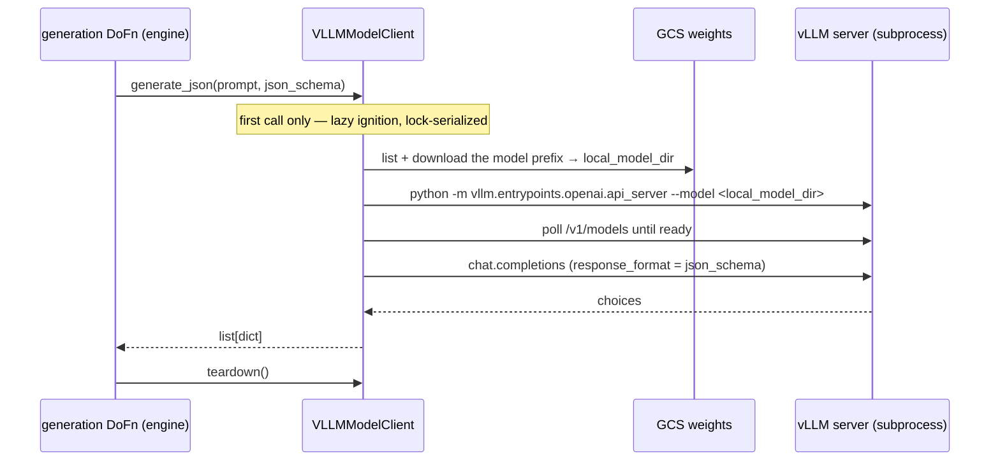

# Model storage layout

Where model weights live, in what format, for which runner.

## TL;DR

| Runner | Model source | Inference backend | Weight format |
|---|---|---|---|
| **DirectRunner (this laptop)** | `FakeModelClient` (no real model) | n/a — test fake | n/a |
| **DirectRunner (M4 — stretch / optional)** | `./models/{family}/{model}/{version}/` | MLX, llama.cpp, or vLLM-CPU | safetensors (or GGUF) |
| **Dataflow (L4 GPU workers)** | `gs://{bucket}/synthetic/models/{family}/{model}/{version}/` | vLLM with CUDA | safetensors + AWQ Q4 |

For DirectRunner work no real model is needed — `FakeModelClient` substitutes. Everything below is for the real-LLM paths (shipped; kept as the staging reference).

---

## Canonical GCS layout (Dataflow workers)

```
gs://{bucket}/synthetic/models/
├── gemma4/
│   ├── e4b-it/v1/                  # Gemma 4 E4B (4.5B effective) — dev / cost-floor
│   │   ├── config.json
│   │   ├── tokenizer.json
│   │   ├── tokenizer_config.json
│   │   ├── special_tokens_map.json
│   │   ├── generation_config.json
│   │   ├── model-00001-of-00002.safetensors
│   │   ├── model-00002-of-00002.safetensors
│   │   └── model.safetensors.index.json
│   └── 26b-a4b-awq/v1/          # Gemma 4 26B A4B MoE, Q4-AWQ — primary production
│       ├── config.json
│       ├── tokenizer.json
│       ├── tokenizer_config.json
│       ├── special_tokens_map.json
│       ├── generation_config.json
│       ├── quant_config.json
│       └── model.safetensors    # AWQ-quantized; may be sharded depending on packer
├── qwen2.5/7b-it/v1/            # Optional cross-family check (Apache-2.0)
│   └── … (same layout)
└── embedders/
    └── bge-small-en-v1.5/v1/    # For B.1 RAG
        ├── config.json
        ├── model.safetensors
        ├── tokenizer.json
        ├── tokenizer_config.json
        └── special_tokens_map.json
```

Rules:
- The addressable unit is the **`{family}/{model}/{version}/` triple**. The pipeline flag is `--model_uri=gs://{bucket}/synthetic/models/gemma4/e4b-it/v1/`.
- Version directories are **immutable**. New version = new directory. Never overwrite `v1/` — bump to `v2/`.
- Worker `setup()` runs **one** `gsutil -m cp -r {model_uri}/ /local-ssd/model/` per worker lifetime; vLLM loads from the local-SSD path.

## Local layout on the M4

Mirror the GCS structure under the repo's `./models/` (gitignored — see `.gitignore`):

```
~/IdeaProjects/synthetic-dataflow-bigquery/
└── models/                       # gitignored
    └── gemma4/
        ├── e4b-it/v1/               # ~9 GB at FP16 — fits comfortably on M4 24 GB
        └── 26b-a4b-awq/v1/       # ~13 GB at Q4-AWQ — tight but fits
```

The pipeline flag accepts both `gs://…` and local paths, so the same code path works for laptop/M4-local and Dataflow.

## Apple Silicon (M4) caveat

vLLM targets CUDA. On the M4's unified-memory GPU it will fall back to CPU (slow) — for real local inference on M4 you'd typically use one of:

- **MLX / mlx-lm** — Apple's framework, fast on M-series. Reads HuggingFace-layout safetensors directly.
- **llama.cpp / GGUF** — needs converted GGUF weights (`convert-hf-to-gguf.py`).
- **Ollama** — wraps llama.cpp.

A future `MLXModelClient` (out of M1 scope) would slot into the `ModelClient` Protocol exactly the same as `VLLMModelClient`. The Beam DAG doesn't care.

For M1 specifically, **on M4 you have two practical paths**:
1. `FakeModelClient` + DirectRunner — exercise the pipeline locally with no GPU.
2. `VLLMModelClient` on Dataflow with L4 workers — the production path.

A real-model DirectRunner run on M4 with MLX is a nice-to-have for §6 (B.2 spike) and §7 (B.1 spike), not a blocker.

## How to download (canonical procedure)

The non-HuggingFace source for Gemma is **Kaggle** (Google-hosted, license-clean).

1. On the M4, install the Kaggle CLI and authenticate:
   ```bash
   pip install kaggle
   # Drop ~/.kaggle/kaggle.json with your API token (Kaggle → Settings → API)
   chmod 600 ~/.kaggle/kaggle.json
   ```
2. Accept the Gemma model license once on the Kaggle model page (https://kaggle.com/models/google/gemma-4).
3. Download:
   ```bash
   mkdir -p models/gemma4/e4b-it/v1
   kaggle models instances versions download google/gemma-4/transformers/e4b/1 \
     -p models/gemma4/e4b-it/v1
   # Kaggle delivers as a zip — extract in place
   unzip models/gemma4/e4b-it/v1/*.zip -d models/gemma4/e4b-it/v1/
   rm models/gemma4/e4b-it/v1/*.zip
   ```
4. Verify the file-level checklist below.
5. Upload to GCS for Dataflow workers:
   ```bash
   gsutil -m cp -r models/gemma4/e4b-it/v1/ gs://{bucket}/synthetic/models/gemma4/e4b-it/v1/
   ```

For Qwen (not on Kaggle), download from ModelScope: `modelscope download --model Qwen/Qwen3-4B-Instruct-2507 --local_dir models/qwen3/4b-instruct-2507/v1` (same for `Qwen/Qwen2.5-7B-Instruct` → `models/qwen2.5/7b-instruct/v1`). The local path MUST mirror the registry `gcs_uri` suffix — `scripts/deployment_prerequisites.py` step 3 checks `models/{family}/{model}/{version}` derived from that URI.

## File-level checklist

Every `{family}/{model}/{version}/` directory MUST contain, at minimum:

- `config.json` — model architecture + hyperparameters
- `tokenizer.json` (or `tokenizer.model` for SentencePiece-based tokenizers)
- `tokenizer_config.json` — tokenizer wrapper config
- `special_tokens_map.json` — BOS / EOS / PAD token ids — **gemma-family only**: Qwen checkpoints (HF and ModelScope) do not ship it; their special tokens live in `tokenizer_config.json`, and `transformers`/vLLM load fine without it. The preflight requires it only for embedders.
- One or more `*.safetensors` files — model weights
- `model.safetensors.index.json` — required when weights are sharded across multiple `*.safetensors` files

Recommended:
- `generation_config.json` — default sampling params (vLLM picks these up)
- `chat_template.jinja` or `chat_template.json` — for instruction-tuned chat models

For AWQ-quantized variants, additionally:
- `quant_config.json` — AWQ quantization parameters (`zero_point`, `q_group_size`, `w_bit`, etc.)

### Qwen from ModelScope — expected file set

Verified against the 2026-07 downloads (`qwen2.5/7b-instruct`, 4 shards, 14.2GB;
`qwen3/4b-instruct-2507`, 3 shards, 7.5GB):

- `config.json`, `generation_config.json`, `tokenizer_config.json`
- `tokenizer.json` **plus** the BPE pair `vocab.json` + `merges.txt`
- `model-0000N-of-0000M.safetensors` + `model.safetensors.index.json`
- `configuration.json` — ModelScope catalog metadata (2-73 bytes); harmless,
  upload or skip
- NO `special_tokens_map.json` — expected, see the checklist note above

Serving note: both checkpoints are **bf16**. On T4 pass `vllm_dtype=float16`
(fp16-safe family; the DAG exposes the param). Qwen2.5-7B does not fit a T4
at all (weights 14.2GB > the 13.6GB budget) — L4 only.

For GGUF (llama.cpp / Ollama path):
- Single `*.gguf` file is sufficient. No accompanying `config.json` — GGUF is self-describing. Tokenizer is embedded.

### Embedders (B.1 RAG) — bge-small checklist

The embedder is **not** loaded via sentence-transformers. `BgeEmbedder`
(`sdfb_core/engines/b1_rag/embedder.py`) uses raw `transformers`
`AutoModel` + `AutoTokenizer` and does its own mean-pool + L2-normalize, so
only the files those two loaders read are needed. Deploy exactly these 5:

- `config.json` — architecture for `AutoModel` (builds the `BertModel`)
- `model.safetensors` — weights (prefer `.safetensors`; drop the redundant `pytorch_model.bin`)
- `tokenizer.json` — fast WordPiece tokenizer (self-contained; embeds the vocab)
- `tokenizer_config.json` — tokenizer wrapper config (`do_lower_case`, max length)
- `special_tokens_map.json` — `[CLS]/[SEP]/[PAD]/[UNK]/[MASK]` ids used by padding/truncation

Do **not** upload the sentence-transformers layout files (`modules.json`,
`config_sentence_transformers.json`, `sentence_bert_config.json`,
`1_Pooling/`), the ONNX export (`onnx/model.onnx`), the duplicate
`pytorch_model.bin`, or the Kaggle download archive — none are read by this
loader. `vocab.txt` is optional (the fast tokenizer already embeds it).

## Runtime load — Dataflow / vLLM

`VLLMModelClient` (`sdfb_beam/handlers/vllm_client.py`) owns the vLLM server on
each worker ([ADR 0014](https://github.com/albertols/synthetic-llm-dataflow-bigquery/blob/4cba0b6053cf7e9b28434d339ff6e927c981b041/docs/adr/0014-vllm-model-client-owns-server.md), which amends
[ADR 0011](https://github.com/albertols/synthetic-llm-dataflow-bigquery/blob/4cba0b6053cf7e9b28434d339ff6e927c981b041/docs/adr/0011-adopt-beam-vllm-model-handler.md)). It does **not** use
Beam's `RunInference` or `apache_beam.ml.inference.vllm_inference`: the engines
call the model a bounded number of times per run, synchronously from inside the
generation `DoFn`, so there is no `PCollection` of prompts for a `ModelHandler`
to batch.



```python
client = VLLMModelClient(
    model_uri="gs://<bucket>/synthetic/models/gemma4/e4b-it/v1/",
    vllm_server_kwargs={"max-model-len": "8192"},  # per model: config/models.yml
)
rows = client.generate_json(prompt, json_schema)   # ignites the server on first use
client.teardown()
```

Weights are pulled with the `google-cloud-storage` Python client (not `gsutil`:
the CLI would add an apt repository to the image). A bare local path as
`model_uri` skips the pull.

`HF_HUB_OFFLINE=1` and `TRANSFORMERS_OFFLINE=1` are set in `docker/Dockerfile` so any accidental Hub call fails loudly. The model directory must be self-contained.

### vLLM acceptance — what the Dataflow probe must confirm

GPU validation happens via a small Dataflow probe job once the image is built (e.g. a low-`num_rows` tier from [`public_cloud/deploy/gcp/run_e2e.sh`](https://github.com/albertols/synthetic-llm-dataflow-bigquery/blob/4cba0b6053cf7e9b28434d339ff6e927c981b041/public_cloud/deploy/gcp/README.md), or a Composer trigger) — there's no separate laptop test (vLLM is CUDA-only). The probe must confirm the vLLM serving path:

- **Server loads the model** — `Gemma4ForConditionalGeneration` accepted (needs vLLM ≥ 0.21; see version note below).
- **Thinking channel suppressed** — pass `chat_template_kwargs={"enable_thinking": False}` via the **chat** endpoint (not raw completions); otherwise the model spends the token budget on chain-of-thought and truncates the JSON.
- **Guided JSON conforms** — `extra_body={"guided_json": schema}` yields schema-valid output ([ADR 0011](https://github.com/albertols/synthetic-llm-dataflow-bigquery/blob/4cba0b6053cf7e9b28434d339ff6e927c981b041/docs/adr/0011-adopt-beam-vllm-model-handler.md)).

> **Version requirement (resolved 2026-05-21):** Gemma 4 (`model_type=gemma4`) needs **transformers ≥ 5.5.0**, which vLLM only adopted in **v0.20.0** (v0.21.0 deprecates transformers v4). Older vLLM fails at config parse (`rope_scaling should have a 'rope_type' key`). The `[gpu]` extra pins `vllm>=0.21.0` and `[embedding]` `transformers>=5.5.0`. vLLM has full Gemma 4 support (MoE, multimodal, reasoning, tool-use) since v0.20 — no fallback model needed. Before the probe: `uv lock`, and confirm the CUDA runtime bundled in the resolved torch wheels is supported by the Dataflow-installed NVIDIA driver.

## Runtime load — local M4 (stretch goal, MLX example)

```python
# An MLXModelClient would look roughly like this — not in M1 scope.
def setup(self):
    from mlx_lm import load
    self.model, self.tokenizer = load(str(self.local_model_path))
```

## What NOT to do

- ❌ Do not commit model weights — they're in `.gitignore` (`models/`, `*.safetensors`, `*.gguf`, `*.bin`).
- ❌ Do not call `from_pretrained("org/repo")` against the Hub at runtime. `HF_HUB_OFFLINE=1` in production is there to make this fail loudly.
- ❌ Do not store whole-archive model blobs in BigQuery / GCR / Artifact Registry. GCS-as-a-flat-directory-prefix is the contract; vLLM expects a directory layout.
- ❌ Do not mix multiple model versions in one directory. New version = new `vN/` subdirectory.
- ❌ Do not put models inside `packages/` — they're operational artifacts, not source code. `./models/` at the repo root is the convention.
